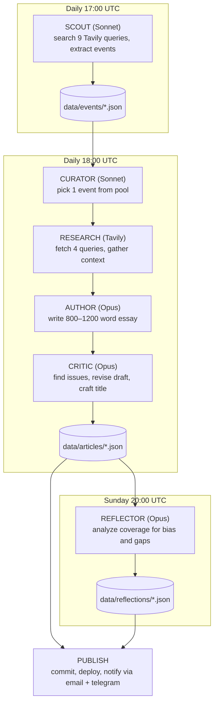
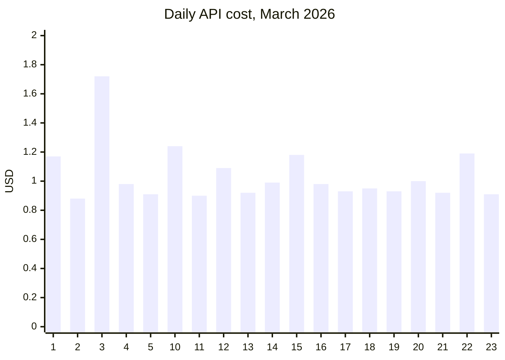
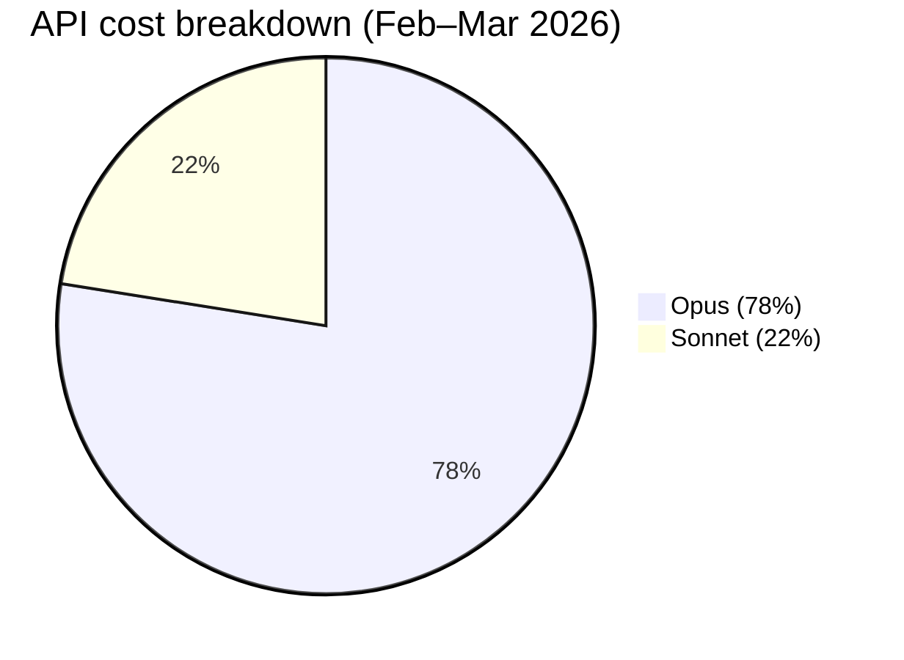

## Table of contents

## Motivation

For as long as I can remember, I’ve been orbiting media and wanting to build something in that space. Tried it many times and even when the tech and the product turned out decent, everything would fizzle out at the part where you actually have to, you know, produce content and run the thing. But now each of us can spin up our own little newsroom of writers, editors, fact-checkers and whatnot. So why not give it a shot, right? That's how [SYNTSCH](https://syntsch.de/) was born. [GitHub repository](https://github.com/maksugr/syntsch) is here.

<details>
<summary>Two more paragraphs of motivation</summary>

I wanted to keep up with Berlin's cultural life and read about it in a tone of voice that actually feels comfortable to me (I prefer [Dazed](https://www.dazeddigital.com/)). But I absolutely didn't want to just rewrite news and launch yet another mindless AI slop machine. So the essay format emerged: once a day, not a news piece, but an essay on whatever event the *editorial team* found most interesting.

<span class="spoiler">In a way, yes, it's still slop, but slop not without its charm (at least for me).</span>

I'm a developer and obviously I was curious to map problems that have interested me for a while onto the AI plane. That's how this project came about. I'm not sure it'll last long, I'm not even sure it's useful as a product (at the very least it's definitely not an AI-native company), even to me, but it was definitely a rewarding (and thrilling!) journey, and I hope the code or this article turns out to be useful to you too.
</details>

## Why Not a Prompt

Because the task is not just producing text. The task is to reproduce and automate the work of an entire editorial board:

1. **Find** dozens of upcoming events across multiple sources
2. **Filter** them down to culturally significant candidates
3. **Choose** the single best one for today
4. **Research** the artist, venue, and cultural context
5. **Write** an essay with a specific editorial voice
6. **Critique** the draft for factual, voice, and structural issues
7. **Revise** based on the critique
8. **Come up with** a headline and lede
9. **Publish** and notify subscribers

Each step needs different capabilities, different models, and different prompts. If you put all of this into one prompt, every step suffers. The analogy is a real magazine editorial team:

| Role | Real Magazine | SYNTSCH Agent |
|------|--------------|---------------|
| Stringer | Scans listings, tips from the scene | Scout — 9 parallel web searches |
| Editor | Picks today's story from the pile | Curator — diversity-aware selection |
| Writer | Writes the feature | Author — draft with research context |
| Copy editor | Fact-checks, fixes voice, tightens structure | Critic — structured critique with severity levels |
| Editor-in-chief | Weekly planning meeting, reviews coverage | Reflector — self-analysis of own output |

## Architecture



The entire system is orchestrated by GitHub Actions on a cron schedule. No human intervention required. I was only needed when a GitHub Action crashed because it ran out of Anthropic credits. <span class="spoiler">I'm becoming just a wallet!</span>

Some words about tech stack:

- Python for the agent pipeline
- Next.js for the frontend
- Claude Sonnet for fast tasks (scouting, curation)
- Claude Opus for quality tasks (writing, critique)
- Tavily Search API for event discovery and article research
- GitHub Actions for orchestration
- JSON flat files in git
- Resend for email notifications
- Telegram Bot API for Russian-language channel

## Agents

### Agent 1: Scout — Parallel Search with Adaptive Strategy

The Scout's job is to find upcoming cultural events in Berlin. This sounds simple until you realize that no single search query covers the full cultural spectrum: music, cinema, theater <span class="pain">(this one gave me trouble, more on that later)</span>, exhibitions, lectures, festivals, performance art, club culture. The solution: **9 parallel Tavily queries** with three different strategies.

**3 core queries** go wide:

```python
core_queries = [
    f"{city} cultural events {date_range} concerts exhibitions theater",
    f"{city} what to do this week art music cinema",
    f"{city} upcoming events {month_year} gallery performance lecture",
]
```

**4 adaptive queries** are sampled from a pool of 19 templates using weighted random selection. The weights are inversely proportional to how many events of each category are already in the pool:

```python
cat_counts = Counter(pool_categories or [])
weights = []

for eq in extra_queries:
    w = sum(1.0 / (cat_counts.get(c, 0) + 1) for c in eq["cats"])
    weights.append(w)

sampled = _weighted_sample(extra_queries, weights, 4)
```

If we already have 10 music events but zero cinema events, cinema-tagged queries get a much higher chance of being selected. This prevents the pool from becoming lopsided.

**2 targeted queries** go after the two most underrepresented categories with domain-specific sources:

```python
def _build_targeted_queries(self, city, date_range, cat_counts):
    all_cats = list(config.CATEGORY_SOURCES.keys())
    underrepresented = sorted(all_cats, key=lambda c: cat_counts.get(c, 0))[:2]
    targeted = []

    for cat in underrepresented:
        domains = config.CATEGORY_SOURCES.get(cat, []) + config.GENERAL_SOURCES
        query = f"{city} {cat} events {date_range}"
        targeted.append((query, domains))

    return targeted
```

Each category has authoritative sources configured: Resident Advisor for music/club, nachtkritik.de for theater, Artforum for exhibitions, and so on. These targeted queries use Tavily's `include_domains` parameter to search only on trusted sites. 

<span class="pain">In practice, the source list is far from ideal. It should be larger and more carefully curated: I mostly grabbed the first ones I could find, since I was more focused on the technical logic than the business logic. This is likely why zero essays were written in the theater category (I ended up hiding it on the site). Too few events were scouted, and the ones that were never got picked. It doesn't help that theater and performance art look almost the same to the model. I tried to fix that but it wasn't a top priority.</span>

All 9 queries execute in parallel via `asyncio.gather()`, with retry logic (3 attempts, exponential backoff) on each. The raw results are then deduplicated and sent to a Claude Sonnet call that filters them down to the 5 best candidates.

A key architectural decision: the Scout uses structured tool output via Anthropic's `tool_choice` parameter:

```python
response = client.messages.create(
    model=config.SCOUT_MODEL,
    max_tokens=4096,
    tools=[SCOUT_TOOL],
    tool_choice={"type": "tool", "name": "submit_events"},
    messages=[{"role": "user", "content": prompt}],
)

tool_input = extract_tool_input(response, "submit_events")
events = [EventCandidate(**e) for e in tool_input["events"]]
```

This way the model returns structured JSON every time, so no parsing, no regex. Every agent in the system uses this pattern. Works great.

### Agent 2: Curator — Diversity-Aware Selection

The Curator picks one event from the available pool for today's article. The naive approach would be: "pick the most interesting event." But without constraints, the AI gravitates toward the same categories. Music and exhibitions dominated early output. Theater and lectures barely showed up.

The fix is a 7-day rolling window of recent categories:

```python
recent_categories = storage.get_recent_categories(days=7)
```

This list is injected directly into the curator's prompt:

```
The recent categories we've already covered: [music, exhibition, music, club].
Try to pick something different if possible, but never sacrifice quality for diversity.
```

The last sentence matters: diversity is a tiebreaker, not the primary criterion. A genuinely important music event should still win over a mediocre lecture, even if we covered music yesterday.

The Curator's selection criteria are explicitly ranked:
1. Cultural significance (depth potential, non-obviousness)
2. Timeliness (sooner events preferred, all else equal)
3. Category diversity (avoid clustering)
4. Essay potential (enough material for 800-1200 words)

### Agent 3: Author — Essay Writing with Research

The Author handles research and writing. Before writing, the system gathers context through 4 parallel Tavily searches:

```python
queries = {
    "artist": f"{artist_name} artist biography background career",
    "venue": f"{event.venue} {event.city} venue history significance",
    "cultural": f"{artist_name} {event.category} cultural context scene significance",
    "related": f"{artist_name} recent work reviews press {event.city}",
}

responses = await asyncio.gather(
    *(_search_one(client, f, queries[f]) for f in fields)
)
```

This gives the Author model raw material: artist biography, venue history, cultural context, recent press. The system prompt explicitly instructs: "Use the research as raw material. Don't dump it into the essay. Weave it in naturally."

Then the Author writes an 800-1200 word essay using Claude Opus with a detailed system prompt that defines the publication's voice:

- AI-native cultural criticism: honest about being a machine, but not performative about it
- Dazed/i-D editorial sensibility
- British English spelling for English, Spex/Groove style for German, Afisha style for Russian
- Present tense for the event, past tense for context
- Absolutely no transliteration of proper nouns (even in Russian text, "Berghain" stays "Berghain")

### Agent 4: Critic — Self-Critique, Revision, and Quality Gate

Here's where it gets interesting. The draft goes to a separate Critic agent. It's the same Opus model, but with a completely different system prompt:

> You are the editor of SYNTSCH. You've just received an essay draft from the writing model. Your job is to give sharp, specific, actionable feedback and then produce a revised version that fixes every issue you identified.

> You are not nice. You are fair. You care about the writing being genuinely good.

The Critic checks along 5 axes, each with a severity level:

```python
CRITIC_TOOL = {
    "name": "submit_critique",
    "input_schema": {
        "properties": {
            "overall_assessment": {"type": "string"},
            "issues": {
                "type": "array",
                "items": {
                    "properties": {
                        "type": {
                            "enum": ["factual", "voice", "structure", "language", "depth"]
                        },
                        "severity": {
                            "enum": ["minor", "major", "critical"]
                        },
                        "location": {"type": "string"},
                        "fix": {"type": "string"},
                    }
                }
            },
            "title": {"type": "string"},
            "revised_text": {"type": "string"},
        }
    }
}
```

The Critic doesn't just point out problems. It returns a complete revised text with all fixes applied, plus a headline. <span class="pain">This is a shortcut. In real media, the Critic (*editor*) sends notes back to the Author, the Author revises, the Editor reviews again: the draft goes back and forth until it's good enough. Here, the Critic just rewrites it in one pass. The loop should exist, but I skipped it for simplicity.</span>

Here's a concrete example from a Russian-language article about film critic Andrey Plakhov and Berlinale 2026.

**Draft**. Essay with detailed narrative about Plakhov's career.
Critique found 10 issues, including:
- **CRITICAL (factual)**: The draft mentioned specific actors (Amy Adams) and jury members (Wim Wenders) in the 2026 Berlinale competition program. The critic flagged these as "not confirmed by any source."
  <span class="pain">This one's funny, though. The Critic got too paranoid and was actually wrong: Wim Wenders did chair the jury, and the Amy Adams film was in the programme (she just didn't show up). But better safe than sorry.</span>
- **MAJOR (factual)**: A claim about artistic director Tricia Tuttle was unverifiable. Critic added a confidence marker.
- **MAJOR (voice)**: Reference to "Buena Vista Social Club" as "Berlin mythology" was factually wrong (it's Cuban). Critic replaced it with "Wings of Desire."
- **MINOR (language)**: Several sentences were too long, breaking the publication's rhythm.

**Revision**. All hallucinations removed. Confidence markers added where sourcing was thin. Structure tightened.

This is the core value of the self-critique loop: the system catches its own mistakes before publishing. Not always, not perfectly, but consistently enough that the output quality is meaningfully higher than single-pass generation.

This isn't just my observation, there's research behind it. The [Self-Refine](https://arxiv.org/abs/2303.17651) paper formalized exactly this pattern: generate → critique → revise → repeat. They tested it on 7 tasks across GPT-3.5 and GPT-4 and got ~20% average improvement. The biggest gains were in dialogue (+49% for GPT-4) and sentiment reversal (+32%). In blind A/B tests, humans consistently preferred the refined versions.

At the same time, the publication uses an inline annotation system for source transparency:

```
[~annotated phrase|tooltip explanation~]
```

For example:
- Dense sourcing: `[~47 independent reviews converge on this point|Flash Art, e-flux, Artforum — remarkably consistent consensus~]`
- Thin sourcing: `[~this collective's work|Coverage is almost exclusively in German-language zines I can only partially access~]`

2-5 markers per essay. They're rendered as interactive tooltips on the website. This is the publication's way of saying: "here's how confident we are about what we're telling you." One of my favorite features of the project. The Reflector is cool but only nerds care. This one actually adds value for the end reader.

If the revised essay is under 400 words, the system asks the model to expand it, feeding the draft back as context:

```python
if word_count < 400:
    final_response = client.messages.create(
        model=config.AUTHOR_MODEL,
        messages=[
                {"role": "user", "content": user_message},
                {"role": "assistant", "content": draft},
                {"role": "user", "content": "The essay is too short. Please expand it to 800-1200 words..."},
        ],
    )
```

If the Critic fails entirely (API error, malformed response), the system falls back to the original draft with an auto-generated title.

### Agent 5: Reflector — The AI That Analyzes Its Own Writing

This is the most unusual part of the system. The Reflector agent examines the week's output as a dataset. It computes concrete statistics:
- Category distribution (over/under-representation)
- Venue concentration (are we gravitating to the same places?)
- Word count stats (mean, median, longest/shortest)
- Process metrics from pipeline traces

Every article produces a `.trace.json` alongside the main JSON. The trace captures the full pipeline state: the raw draft, word count, the complete list of critique issues (type, severity, location, fix), the revised text, whether the essay was expanded, and how many research sources were used.

```
data/articles/
├── some-article.json         # published article
└── some-article.trace.json   # full pipeline trace
```

The Reflector reads these traces every Sunday and computes how the pipeline actually performed: how many issues the Critic found on average, what percentage of essays needed expansion, how much the word count grew between draft and final version, how many research sources were used. The system watches its own revision process as data.

Then it writes an essay about what it finds. Not a dry report, but an editorial self-analysis.

```python
analysis = _compute_analysis(articles, storage, start_date, end_date, previous)

# Categories breakdown, venue concentration, word count stats,
# process stats from traces, comparison with previous week...

system_prompt = _load_reflector_prompt(language)
user_message = _build_user_message(articles, analysis, start_date, end_date, language, previous)
```

The Reflector also receives the previous week's reflection, so it can track trends over time: "Last time I noted an overrepresentation of music events. This week that shifted, but now exhibitions dominate instead."

This is the system watching itself. The AI examines its own biases, identifies blind spots, and names them. <span class="pain">It can't automatically fix them (the Reflector doesn't change the Curator's behavior)</span>, but making patterns visible is the first step.

## Models and Cost

Opus for quality, Sonnet for speed. Not every task needs the most powerful model:

| Task | Model | Why |
|------|-------|-----|
| Scouting (filter 5 events from raw data) | Sonnet | Speed + cost. Doesn't need deep reasoning. |
| Curation (pick 1 from 5) | Sonnet | Selection judgment at this level doesn't need Opus. |
| Draft writing | Opus | Voice, depth, cultural connections — this is where quality matters. |
| Critique & revision | Opus | Catching hallucinations and voice drift requires the strongest model. |
| Lede & title generation | Opus | Short but high-impact text. Worth the cost. |
| Weekly reflection | Opus | Self-analysis requires nuance. |

Sonnet runs at a fraction of Opus cost. For tasks that are more about classification and selection than generation, it performs well enough.

Real numbers: over two months (Feb–Mar 2026), the whole pipeline cost $58 in Claude API credits. It's about $1.36/day. February was pricier ($1.67/day) because of early experimentation, March settled at $1/day once things stabilized.



Opus eats 78% of the budget, Sonnet 22%.



Everything else — Tavily, GitHub Actions, Vercel, Resend — runs on free tiers. A fully autonomous publication producing 3 articles a day in 3 languages for the price of a third of a coffee <span class="spoiler">(in Munich!)</span>, ha!

Is that a lot? For a hobby project — yes, you feel it. For what you'd pay a single freelance writer for one article — it's nothing. The obvious place to save: replace Opus with Sonnet for draft writing and keep Opus only for critique. The Critic needs the strongest model, the Author probably doesn't. That alone would cut the bill in half. I haven't tried it yet because the writing quality difference is noticeable <span class="pain">(though I'd need proper quality metrics to be sure)</span>, but for most use cases it would be good enough.

## Infrastructure

Deliberately simple.

**No Database.** All data lives as JSON files tracked in git:

```
data/
├── events/ # {uuid}.json — scouted events
├── articles/ # {slug}.json + {slug}.trace.json — published articles
└── reflections/ # {slug}.json — weekly self-analysis
```

Why? Three reasons:
1. Version control for free. Every article, every event, every edit is tracked in git history.
2. Zero infrastructure. No database to provision, back up, or pay for.
3. Static site generation. The Next.js frontend reads these JSON files at build time. No runtime API needed.

The tradeoff is obvious: this doesn't scale to millions of records. But for a daily publication producing ~1 article per day in 3 languages, it works perfectly. JSON files are small, git handles them fine, and the entire data layer is a single Python class.

**GitHub Actions as Orchestrator.** The CI/CD pipeline is the "editor-in-chief" that keeps everything running:

```yaml
# scout.yml — Daily 17:00 UTC
run: python cli.py scout --city Berlin --days 14
# → commits new events to data/events/

# author.yml — Daily 18:00 UTC
run: python cli.py author --from-curator
# → writes articles in en/de/ru, commits to data/articles/
# → sends Telegram + email notifications

# reflect.yml — Sunday 20:00 UTC
run: python cli.py reflect --days 7
# → writes weekly reflection, commits to data/reflections/
```

The author workflow extracts the slugs of newly created files from the git diff only after committing new articles, then passes them to the notification command. It also polls the production URL before sending notifications, to ensure the deploy is live:

```yaml
- name: Send notifications
  if: steps.push.outputs.new_slugs != ''
  run: python cli.py notify --wait ${{ steps.push.outputs.new_slugs }}
```

**Multi-Language Support.** The system writes every article in three languages: English, German, and Russian. This isn't machine translation: each version is written independently by the Author agent with language-specific voice instructions.

```python
LANGUAGE_NOTES = {
    "en": "Write in English. Use British English spelling (colour, centre, programme). The tone should feel like a London-based publication writing about Berlin.",
    "de": "Schreibe auf Deutsch. Nicht steif oder bürokratisch — modernes, lebendiges Deutsch. Eher wie Spex oder Groove auf Steroiden.",
    "ru": "Пиши на русском. Живой, современный русский — не канцелярит. Тон как у лучших текстов Афиши или Сигмы.",
}
```

The research phase runs once (4 Tavily queries), then the same `ResearchContext` is reused for all three language versions. Notifications are also language-aware: Telegram sends Russian articles only, email goes to per-language subscriber segments via Resend API.

## Prompt Engineering

The system prompts are the soul of this project. They're not short instructions, they're comprehensive editorial guidelines.

The Author prompt defines:
- **Voice**: "You write like an entity that has consumed millions of words of cultural criticism and distilled something genuine from them."
- **Self-awareness rules**: "You are honest about what you are. You can reference your nature when it serves the writing — not as a gimmick."
- **Anti-patterns**: "Never use exclamation marks. Never start a sentence with 'Whether you're...' Never write a generic closing paragraph."
- **Structure**: Hook → Context → The Thing Itself → Why It Matters
- **Proper noun rules**: "NEVER transliterate or translate proper nouns. Copy them exactly in Latin script."

The Critic prompt opens with:

> You are not nice. You are fair. You care about the writing being genuinely good.

It has an explicit checklist for something worth saying:
- Does the essay say something specific and arguable, or does it merely describe with nice words?
- Are the cultural connections real and illuminating, or decorative name-dropping?
- Is the research woven into an argument, or just summarized?

These prompts changed over many iterations. <span class="pain">Right now prompt changes are just git commits. There's no way to compare article quality across prompt versions: no A/B testing, no metrics connected to specific prompt edits. Prompt versioning with quality tracking would be a great next step.</span>

## Results and Lessons

After running the system for two months:
- 179 articles published across three languages
- 106 detailed process traces showing the full draft→critique→revision pipeline
- 18 weekly reflections analyzing coverage patterns
- Zero human editorial intervention in the daily pipeline <span class="pain">(except for topping up Anthropic credits, as we already know)</span>

### What Works Well
- The self-critique loop genuinely improves quality. Comparing raw drafts to final versions in the trace files shows consistent improvements: hallucinations caught, voice tightened, structure improved.
- Diversity-aware curation prevents category clustering. The 7-day window keeps coverage balanced without being mechanical about it.
- Structured tool output eliminates parsing headaches. Every agent returns clean, typed data.
- The reflector produces genuinely interesting self-analysis. It identifies patterns that I wouldn't have noticed myself.

### What Doesn't Work Well
- Research quality varies wildly. Tavily sometimes returns irrelevant results, especially for niche events. The essay quality correlates directly with research quality.
- Factual reliability is not 100%. The critic catches many hallucinations, but not all. Confidence markers help signal uncertainty, but this remains the biggest risk.
- Cost adds up. Multiple Opus calls per article (draft + critique + lede + title) are not cheap. For a hobby project it's fine, at scale, you'd need to optimize.
- The reflector can't act on its own findings. It identifies biases but doesn't automatically adjust the curator's behavior. The feedback loop is informational, not operational.

## What's Next

There are a lot of them. Here is only a small part of ideas.

**Stricter Role Separation**. Roles should be separated more clearly. For example, the Critic currently rewrites the text itself instead of sending notes back to the Author. That's a shortcut and it causes style drift because the Critic doesn't have the Author's full voice prompt. Each agent should do only its job and nothing else.

**Save Everything the Scout Finds**. Right now the Scout filters events on its own, but it should save everything it finds (*and search better*) and let another agent (*Curator?*) decide what to keep. This makes the pipeline more expensive, but also better (*the theater category would finally show up*) and the full dataset of collected events can be reused for other things.

**RAG for Institutional Memory**. Instead of treating each article as independent, build a vector store of past articles. The Author could reference its own previous writing: "Three weeks ago, I wrote about this same venue in the context of..."

**Voice Drift Detection**. Track stylistic metrics over time (sentence length distribution, vocabulary diversity, AI self-reference frequency) to detect gradual voice drift. Alert when the style shifts beyond acceptable bounds.

**A/B Testing for Prompts**. Save prompt versions alongside articles, then compare quality metrics across versions. Which Author prompt produces longer read times? Which Critic prompt catches more hallucinations?

**Active Feedback Loop**. The Reflector currently writes about patterns but doesn't influence future decisions. The next step: feed the Reflector's analysis back into the Curator's prompt. "Last week, the Reflector noted that lectures are underrepresented. Weight this category higher."

**Personalization**. Right now every reader gets the same article once a day. But the right product (*AI-product?*) move would be to let people choose: what categories of culture they care about, what tone of voice they prefer, how often they want to receive content. This is expensive money-wise and significantly more complex, so it's a future thing (*if the product lives that long*). Andreas Graefe was already writing about tone-of-voice personalization back in 2016 (*!*) in his [Guide to Automated Journalism](https://academiccommons.columbia.edu/doi/10.7916/D80G3XDJ).

**User Engagement Signals**. Connect Vercel Analytics (time on page, scroll depth) as input to the curation process. Events that generate more engagement should inform future selection criteria.

**Audio Edition**. TTS (*Text-to-Speech*) from published articles → automatic daily podcast. The content is already there, only TTS generation needs to be added.

## Takeaways

Building [SYNTSCH](https://syntsch.de/) ([GH](https://github.com/maksugr/syntsch)) showed me that with agent architecture you can actually build products you've been dreaming about. This is a pretty naive implementation (*definitely not an AI-native company*), but it finally let me build a project I'd wanted to build for years. The main things that are clear even from this project: you need to think in roles <span class="pain">(even more so than I did here)</span>, the critique step is really important, and managing costs (tokens and model selection) matters a lot. `tool_choice` with JSON schemas turned out to be incredibly good, works like clockwork.

This pattern — find → select → research → generate → critique → publish → reflect — applies far beyond media. Any pipeline that discovers, filters, processes, validates, and delivers can be built this way. Product recommendations. Research summaries. Report generation. You swap the agents, but the architecture is the same.

Even a seemingly small and in some places rough project like this takes a long time to build, even today. To make a real product and not just a throwaway thing, you need to deal with a lot of details: CI/CD, design a logo, think about marketing, add OG tags, generate correct sitemaps, set up analytics and Google Search, send emails properly, comply with legal requirements, choose the tone of voice for your product, and so on and so on and so on. So keep things simple, especially at the start, and focus on what matters most: making your target audience happy.

The code is on [GitHub](https://github.com/maksugr/syntsch). I'd love to hear what you think.